# Yuri Rewrite 详细使用指南

本指南面向第一次使用的用户,按实际操作顺序讲解全部功能。截图来自开发演示数据(界面中显示"浏览器测试模式"与《浏览器测试小说》),你实际使用时会显示自己的小说和数据。

> 环境准备、下载安装、隐私说明请先阅读 [README](../README.md)。本指南假设你已完成安装并准备好 AI 服务账号与 API Key。

---

## 1. 界面总览

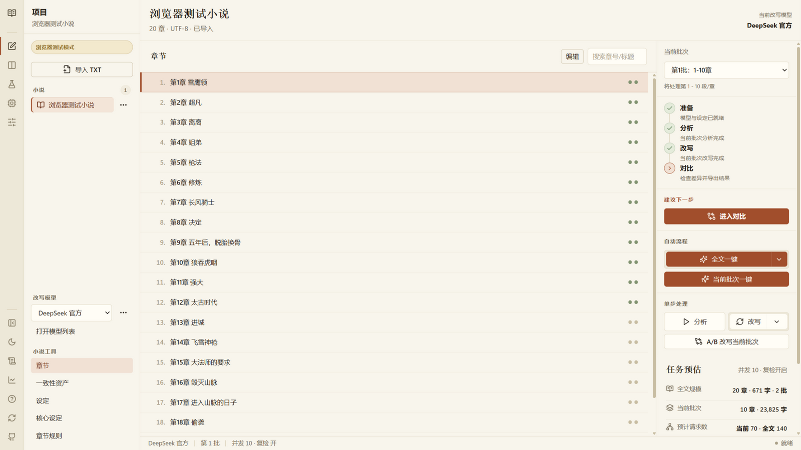

启动后的主界面分为四个区域:

- **左侧活动栏(48px)**:全局功能入口,从上到下依次是主页(工作台)、对比、A/B 实验、管理模型、设置;底部是折叠侧栏、深浅色切换、日志、Token 统计、帮助、检查更新和 GitHub。当前所在页面的图标左侧会显示一条竖线指示。
- **上下文侧栏**:跟随当前页面变化。工作台显示小说列表、改写模型选择和"小说工具"入口(章节、一致性资产、设定、核心设定、章节规则)。
- **中间内容区**:章节列表(单行书目式,右侧两颗状态点分别表示分析与改写状态)、顶部标题栏显示小说名与字数信息。
- **右侧任务中心**:按"准备 → 分析 → 改写 → 对比"显示流程状态、建议下一步、各类操作按钮和任务预估。
- **底部状态栏**:常驻显示当前改写模型、所选批次、并发与复检状态,以及任务运行状态。

右上角始终显示当前使用的改写模型名。

## 2. 第一步:配置模型

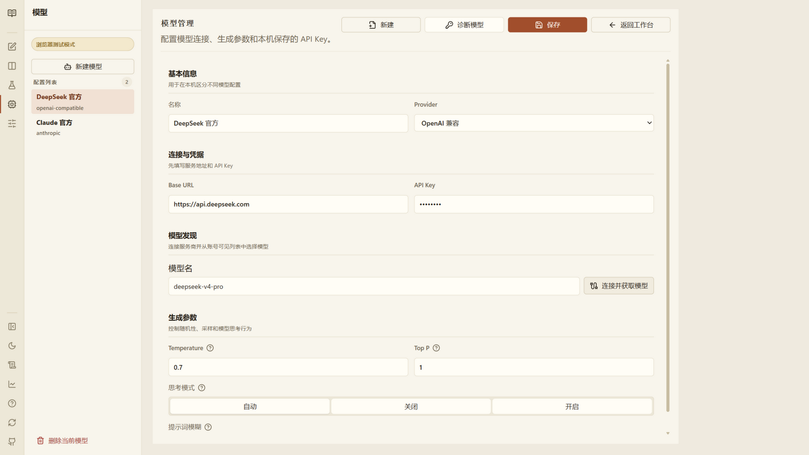

1. 点击活动栏的"管理模型"图标(机器人),进入模型管理页。
2. 填写 **Base URL**(服务商接口地址,不同服务商的写法以服务商文档为准)、**API Key**(保存在 Windows 凭据管理器)、**模型 ID**。
3. 点击"连接并获取模型"可以拉取账号可用的模型列表;也可以手工填写模型 ID。
4. 保存后点击"**诊断模型**",程序会用一次小请求确认模型具备生成能力,并给出诊断结论。

支持 OpenAI-compatible、Anthropic Messages 和 Gemini 三类接口,具体服务商见 README。可以保存多个模型配置,侧栏顶部可切换当前使用的改写模型。

遇到诊断失败时,优先检查 Base URL 结尾是否多余路径、Key 是否有效、账户是否有额度。

## 3. 第二步:导入小说与章节识别

回到工作台,点击侧栏顶部的"**导入 TXT**"按钮(或直接把 TXT 文件拖进窗口)。软件会自动识别编码(UTF-8/UTF-16/GBK/GB18030)、切分章节并生成批次。

导入后每章右侧有两颗状态点:**左点是分析状态,右点是改写状态**(绿色=完成、红色=失败、灰色=待处理、橙色=进行中)。鼠标悬停章节行可以看到文字说明。

### 章节识别规则

软件支持"第一章 / 第1卷 / 序章 / 楔子"等常见中文格式和连续数字标题。作者更新提示("第一更""未完待续""求票"等)会被保守识别为非章节内容;番外、后记、完本感言会保留。

如果切分结果不理想,进入"**章节规则**"页面:

可以自定义章节标题的正则规则并实时预览,还可以开启"长章节自动拆分"(超过 5000 字的正式章自动拆成"(1)(2)"编号)。确认无误后再点生成。

> 注意:一旦开始过分析或改写,就不能再重切分,避免破坏章节与已有结果的对应关系。

## 4. 第三步:小说设定

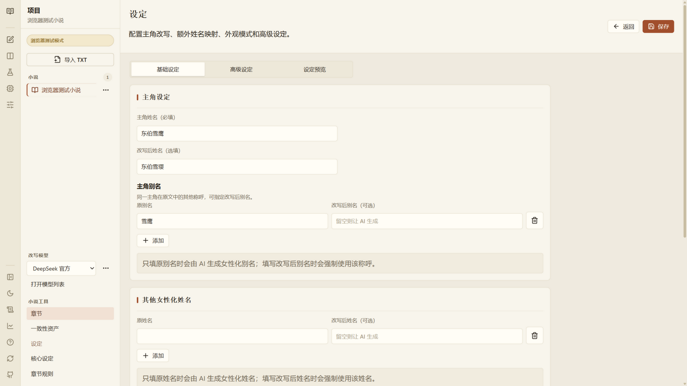

分析之前必须先完成小说设定。页面分基础设定、高级设定和预览三个部分:

- **主角原名 / 改写后姓名**:改写后姓名留空时由 AI 按同音近音规则生成。
- **主角别名**:每行一条。只写别名时,AI 会把该别名识别为同一人物并同步女性化;写 `原名 -> 改写名` 则是强制映射,逐字生效。
- **其他女性化姓名映射**:给非主角人物指定女性化名字,写法相同。
- **女主候选 / 关系对象**:提示模型重点维护与这些角色的百合互动和关系连续性。
- **身材体型 / 改写模式**:严谨模式忠于原文,创意模式会主动强化女性化感知点。
- **高级设定**:全局文风、尺度、描写偏好等长期要求。

设定会随批次、分析、改写自动同步到一致性资产的姓名映射表。

### 核心设定

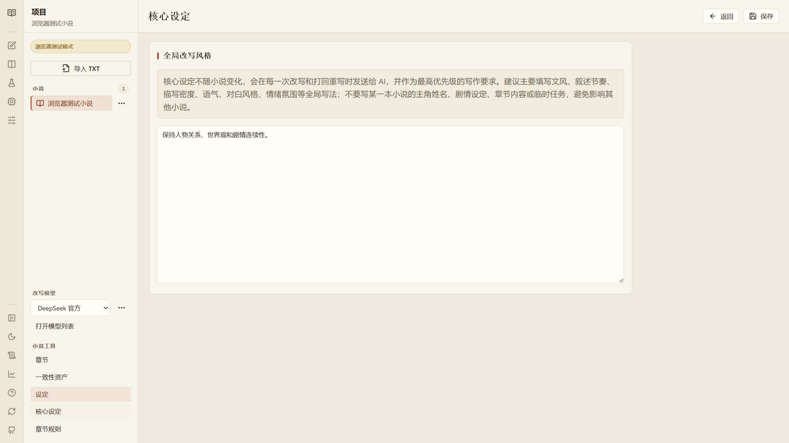

"核心设定"是**所有小说共享**的最高优先级写作要求(例如"保持轻小说对白节奏"),优先级高于普通文风要求,但低于 marker 格式、姓名映射和角色性别规则。

## 5. 第四步:分析与改写

点击"分析当前批次"或"全文一键"后,任务中心顶部出现运行卡片:

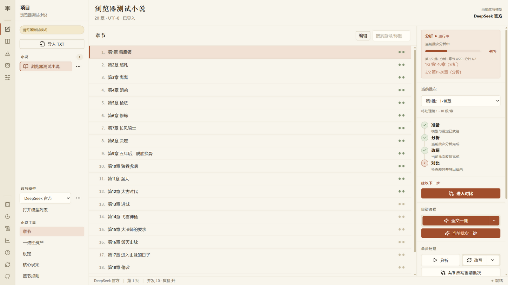

运行卡片显示任务类型、进度条、批次/章节/分片计数和正在处理的分片。分析是改写的前提——它只提取原文事实(人物、性别、关系、伏笔、术语),不会加入百合改写内容。分析产出的一致性资产可以在"**一致性资产**"页查看和手工修正:

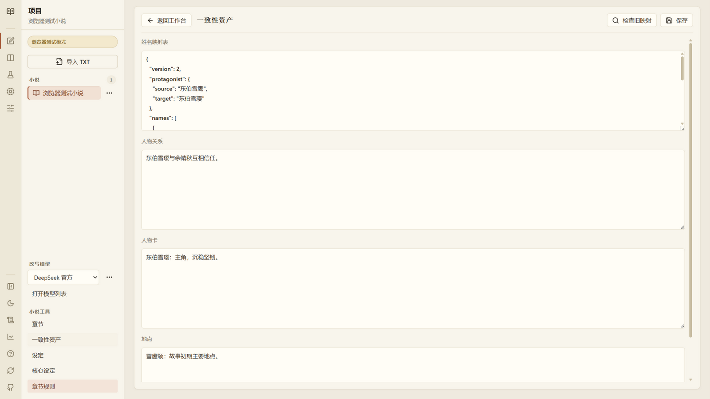

改写完成后,章节状态点变绿,流程进入"对比"。运行期间的失败章节会以红色状态点标记,可以在该批次再次运行"分析/改写"来重试失败部分(已完成的分片不会重做)。

任务运行中可以暂停、继续或终止;限流、网络错误等会自动暂停并保留进度。任务预估面板常驻显示请求数、预计耗时和历史调用。

## 6. 对比与编辑

点击"进入对比"打开对比页:

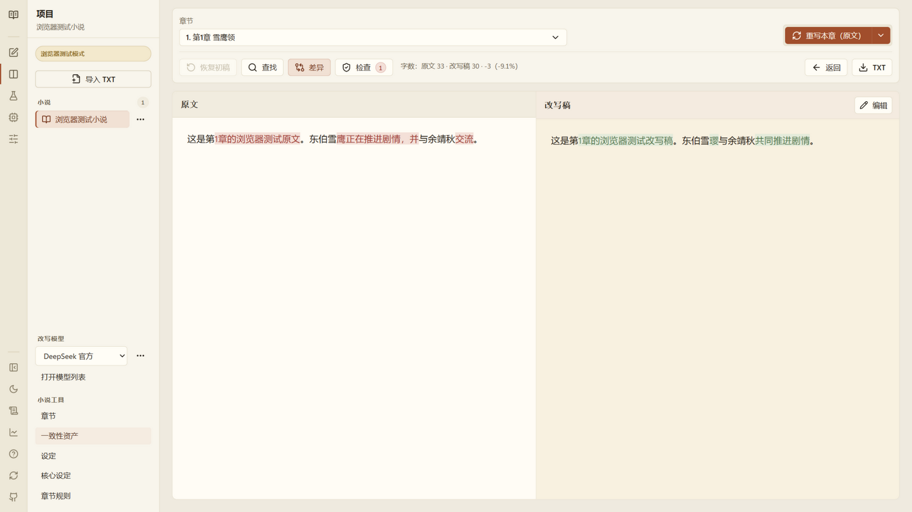

- 左栏原文、右栏正式改写稿,默认开启差异高亮;支持全书搜索(可限定只搜原文或只搜改写稿)、章节跳转、字数对比。
- 可以直接在右栏**编辑改写稿**并保存。
- "**重写本章(原文)**":按原文重新生成本章;"**重写本章(改写稿)**":以当前改写稿为主要底稿继续修改;"**恢复初稿**":恢复第一次重写前的版本。

点击工具栏"检查"打开**本地检查面板**(纯前端规则,不调用模型):

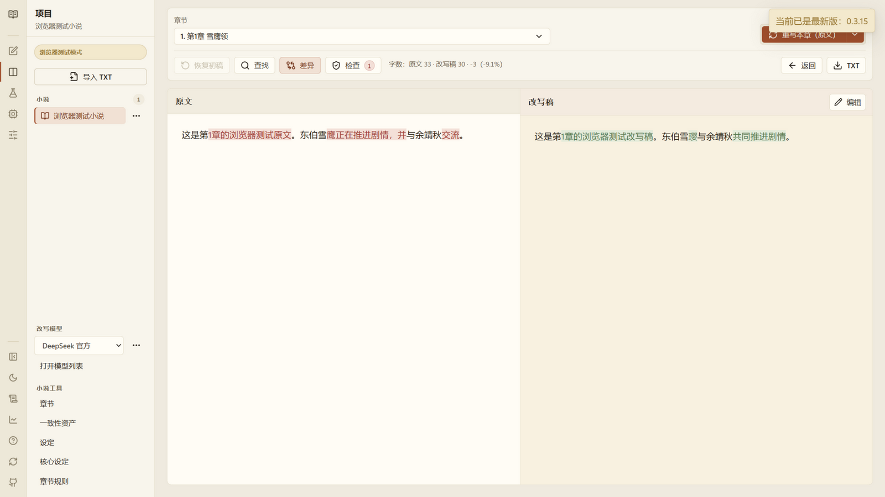

它会提示旧名残留、主角附近男性称谓、可疑群体代词、广告乱码、重复段落、疑似未改写、字数差过大等问题,可逐条忽略或批量忽略当前问题。

## 7. A/B 实验(多模型对比)

在任务中心"单步处理"的"改写"下拉菜单中选择"A/B 改写当前批次":

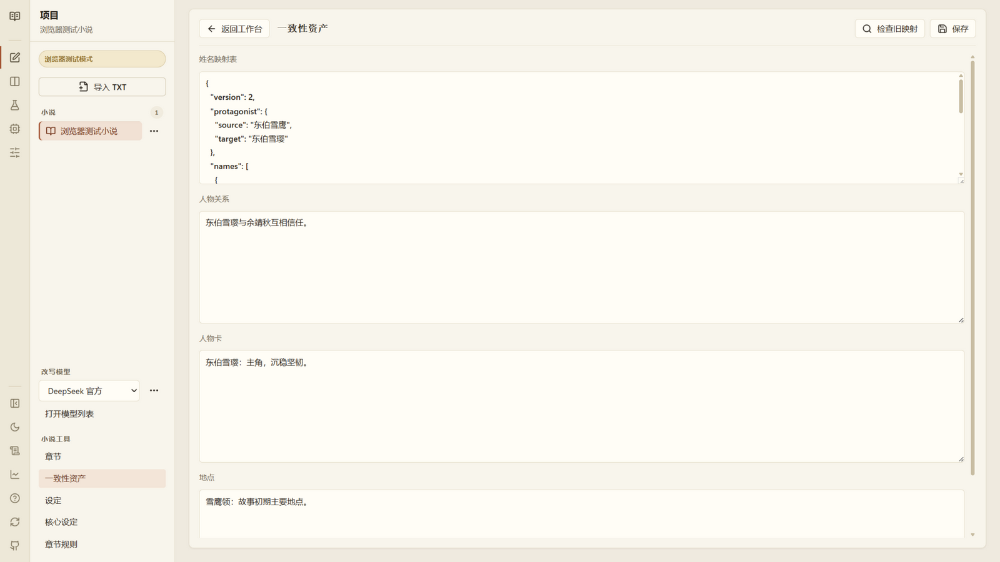

一次选择 2-3 个模型,用相同原文与设定生成独立候选。进入活动栏"A/B 实验"页后可以双栏对比"原文 vs 候选"或"候选 vs 候选",逐章选择最好的版本,**点击"应用所选"才会写入正式改写稿**。混合不同模型的章节请注意检查文风连续性。

## 8. 导出 TXT

对比页工具栏点击 `TXT` 导出。只包含已完成且非空的正式改写章节,不会用原文补齐失败章节;A/B 候选未应用前不会进入导出。导出为原子写入,不会因中断留下损坏文件。

## 9. 日志与 Token 统计

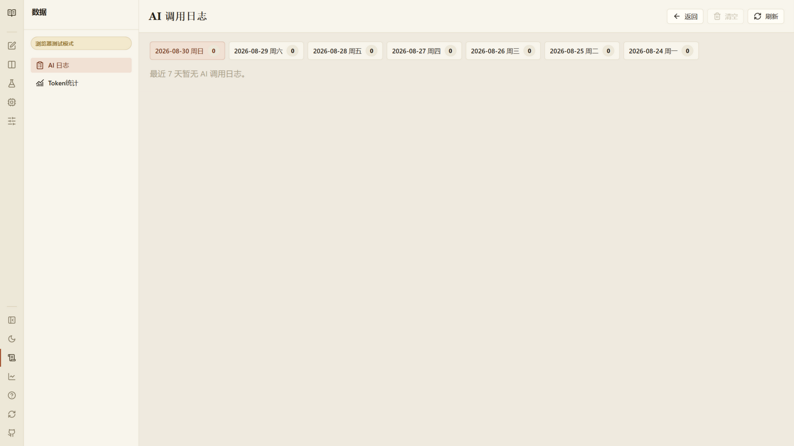

日志页按天查看每次 AI 调用的提示词、思考过程、输出、原始响应和错误。使用支持提示词缓存的服务商时,调用统计会显示**缓存命中的 token 数**(规则与设定作为稳定前缀被服务商缓存,长篇跑批可显著省额度)。

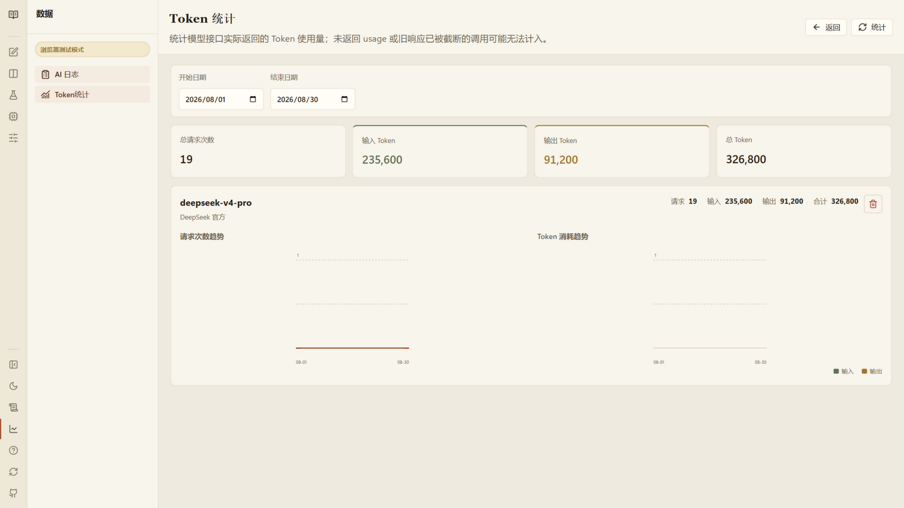

Token 统计独立保存,清空 AI 日志不影响历史 Token 数据。

## 10. 应用设置

设置分三类:

- **模型与复检**:分析/审查模型选择、复检开关(默认开启,最多三次审查两次修复)。
- **任务与并发**:章节批次大小(10/30/50/100)、并发数(1-50,批次越大上限越高)、自动继续开关。
- **文件与数据**:导出目录、删除本地数据(需要输入确认短语,保留原始 TXT 与导出文件)。

## 11. 常见问题速查

| 现象 | 处理 |
| --- | --- |
| 诊断失败 | 检查 Base URL / Key / 模型 ID / 额度,保留的错误信息会说明原因 |
| HTTP 429 限流 | 程序自动等待降并发;重试耗尽会暂停,等额度恢复后继续 |
| HTTP 502/503/504/524 | 服务商临时不可用,恢复或换代理后继续未完成分片 |
| 安全策略拦截 | 调整设定、开启"提示词模糊"或更换模型后继续 |
| 审查 JSON 无法解析 | 手动重试;频繁出现请换 JSON 更稳定的复检模型或降并发 |
| marker/截断错误 | 程序自动重试并缩小分片;建议换最大输出更高的模型 |
| 个别章节分析失败 | 再次运行该批次"分析",已完成章节自动跳过 |
| 想恢复出厂状态 | 设置 → 本地数据 → 删除本地数据(需输入确认短语) |

更完整的说明见 [README 常见问题](../README.md#常见问题)。
